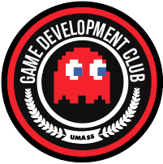

## RobotFighter (ง •̀_•́)ง
RobotFighter is a game were you play as robots that face off against each other in 1v1 battles. As the battle goes on the robots will break down which changes how they play revealing new abilities and strategies.

## Work in Progress
This Gitrepo is a work in progress and will be updated as progress is made.

## Made by

The Game Development Club on UMass Lowell is a club dedicated to fostering a community that works together to create fun and interesting games

[Griffin Nozell](https://github.com/gnozell)
| [Kevin Holmes](https://github.com/UnsureSherlock)
| [Kynan Pacheco](https://github.com/KynanPacheco)
| [Manoj Malipeddu](https://github.com/jonam33)
| [Mike Forsyth](https://github.com/mike01720)
| [Nandan Rey Kulkarni](https://github.com/Nandan307)
| [Nick Forsyth](https://github.com/nick01720)
| [Ramon Meza](https://github.com/ramonmeza)
| [Tim Larocque](https://github.com/timLarocque)
| [Travis Sivat](https://github.com/Sivat394)

## License

MIT © [Game Development Club UML](https://github.com/gnozell/robotfighter)
